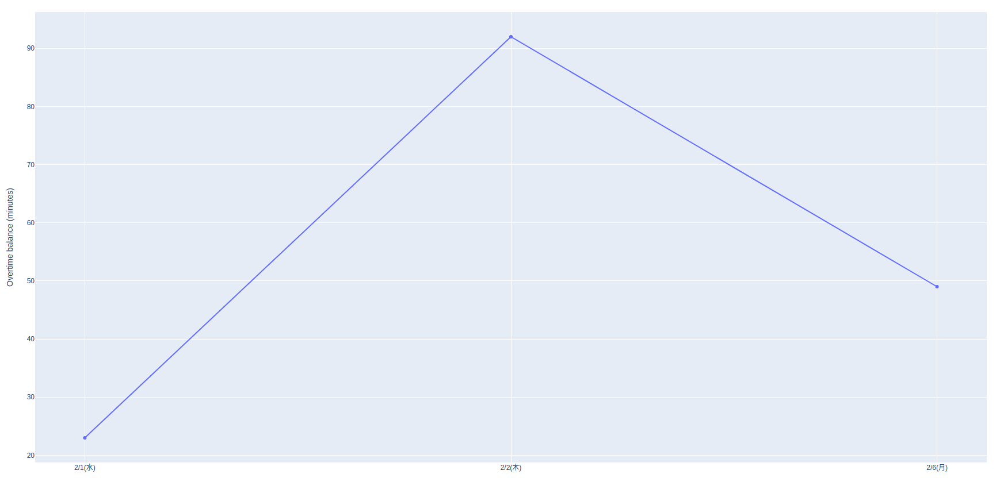

# RecoLul

## Installation

```
pip install recolul
recolul config
```

## Usage

### Overtime balance

```shell
$ recolul balance
Monthly overtime balance: 00:51

Last day 2/6(月)
  Clock-in: 09:10
  Working hours: 07:19
  Break: 01:00
```

### Overtime balance graph

```shell
$ recolul graph
```



### When to leave

```shell
$ recolul when
Leave today at 17:43 to avoid overtime (includes a 1-hour break).
```

## Config

### Environment variables

- `RECORU_AUTH_ID`
- `RECORU_CONTRACT_ID`
- `RECORU_PASSWORD`

### Config file

```
recolul config
```

## Build

```
python -m build
```
